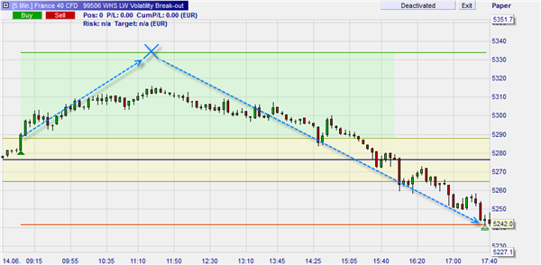
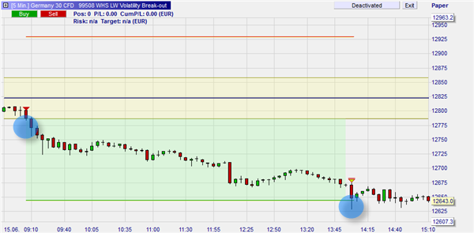

# **Increasing Stock Returns by modifying Williams Break-Out Volatilty Strategy**


## Project Team Members:
- Andrew Crawford
- Servontius Turner
- Sylvia Fan
- Sam Kohnle

---

## Project Objective  

---

In this project we explore the Williams Break-Out Volatility (BOV) strategy. With the help of python, we will compare the returns of our Williams BOV strategy returns with the returns of SPY ETF to see how the strategy performs in the real-world market.

---


## About The Strategy

---

Volatility Break-out strategies are based on the concept that if the market makes a movement of a certain size in a short period of time, this movement will continue and positions can be opened to capitilize on this movement. Volatility, as [defined by Investopedia](https://www.investopedia.com/terms/v/volatility.asp), is the measurement of movement by either the Standard Deviation or variance between the same security. While the typical Volatility strategy and that definition don't match 1-to-1, the thought behind them are the same. A particular strategy created by trader Larry Williams includes a multiplier number in order to figure out how large the move needs to be before a trader takes action. By default, Larry suggests 25%. That number is then multiplied by the previous day’s High and Low. Those respective numbers are then added and subtracted from the current Open price to create a "Range"<sup>1</sup>.


Larry Williams then suggests opening a position based on the following factors:

- Long: When price rises higher than the breakout area
- Short: when the price falls below the breakout area

Larry also has suggests closing a position if:

1. When the current price is two times (2x) the range

	or

2. After 24hours




---
## Our Modifications

---

We want to find out if this strategy can be improved on using Machine Learning to determine if we can find a better % multiplier to use or if Larry Williams was on the money with the use of a 25% move. We are looking to use the following markets to test:

- S&P 500 Index (Stock ticker SPX)
- CBOE Volatility Index (Symbol VIX)
- Bitcoin (Symbol BTC)

We are hoping to answer the following questions:

1. Does a 25% move produce a winning trading strategy?
2. Can Machine Learning provide a better metric for price movement than what Larry Williams presents?
3. Can one trade using this strategy and the default 25% move or ML percent move perform better than buying and holding a security?
4. If successful, how often does this strategy require review of the percent move number?

---

# Implementation in Python
1. Importing Packages
2. Extracting Stock Data from Alpaca
3. Williams BOV Logic
4. Williams BOV Signals Plot
5. Creating the Trading Strategy
6. Plotting the Trading Lists
7. Creating our Position
8. Backtesting
9. SPY ETF Comparison


## Step 1: Imports

### Install packages not included with Colab
```
!pip install python_dotenv
!pip install alpaca_trade_api
!pip install backtrader
!pip install hvplot`
```


### Import Packages

```
from alpaca_trade_api.rest import TimeFrame
import alpaca_trade_api as tradeapi
from alpaca_trade_api.stream import Stream
import backtrader as bt
import matplotlib
import pandas as pd
from alpaca_trade_api import TimeFrameUnit
from pandas.core.frame import DataFrame
import numpy as np
import requests
import matplotlib.pyplot as plt
from math import floor
from termcolor import colored as cl
import hvplot.pandas
from pathlib import Path

```


### Import Machine Learning packages

```
from sklearn import svm
from sklearn.preprocessing import StandardScaler
from pandas.tseries.offsets import DateOffset
from sklearn.metrics import classification_report
```

### Plots parameters
```
plt.rcParams['figure.figsize'] = (20,10)
plt.style.use('fivethirtyeight')
```


## Step 2: Datasets Used:
We will be using data obtained from multiple APIs to compare dataset differences. 

Real-time stock and crypto data:

- [twelvedata_api_url](https://api.twelvedata.com/time_series?symbol={symbol}&interval=1day&outputsize=5000&apikey={api_key})


## Step 3: Williams Break-Out Volatility logic


## Step 4: 


## Step 5: 


## Step 6: 


## Step 7: 


## Step 8: 

## Step 9: 

## Additional ideas:

Use a SQL database to hold the stock/crypto data day to day
Design an in-depth dashboard for investors to quickly visualize their portfolios

Are their large arbitrage opportunities when a cryptocurrency has moved + or - 25% in a day.


## Sources
1. [Williams, Larry "Long-Term Secrets to Short-Term Trading" 6 Dec. 2011. Accessed 21Feb. 2022.](https://www.amazon.com/Long-Term-Secrets-Short-Term-Trading-Williams/dp/0470915730/ref=sr_1_2?keywords=long+term+secrets+to+short+term+trading+by+larry+williams&qid=1645494049&sprefix=short+term+sec%2Caps%2C117&sr=8-2)